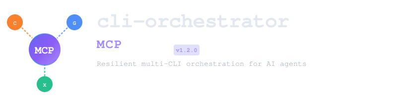
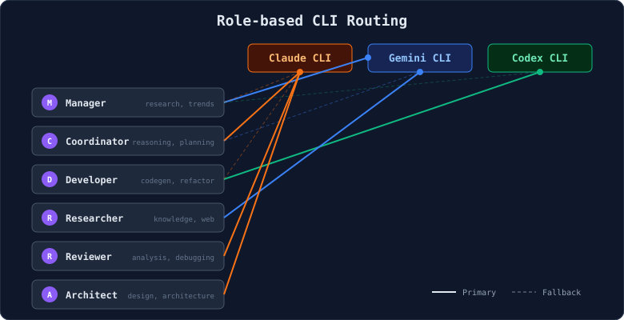
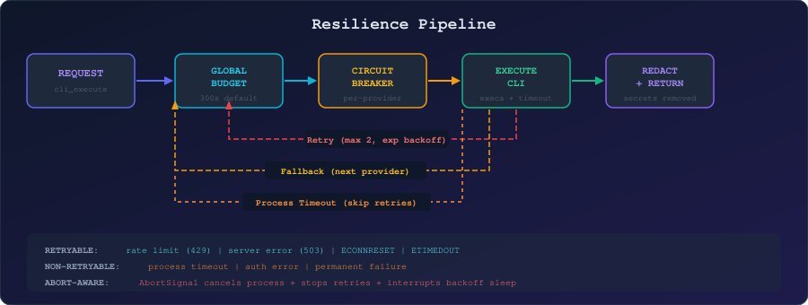

<p align="center">
  
</p>

<p align="center">
  <strong>Resilient multi-CLI orchestration server for AI agents</strong>
</p>

<p align="center">
  <a href="https://www.npmjs.com/package/cli-orchestrator-mcp"></a>
  <a href="https://github.com/lleontor705/cli-orchestrator-mcp/actions"></a>
  
  <a href="LICENSE"></a>
</p>

---

## Why cli-orchestrator-mcp?

Modern AI workflows often need **more than one LLM CLI**. Claude excels at reasoning, Gemini at research, Codex at code generation. But managing multiple CLIs — handling failures, retries, fallbacks, and routing — is complex and error-prone.

**cli-orchestrator-mcp** solves this by providing a single [Model Context Protocol (MCP)](https://modelcontextprotocol.io) server that:

- **Orchestrates** Claude CLI, Gemini CLI, and Codex CLI through a unified interface
- **Routes intelligently** — picks the best CLI based on the agent's role
- **Recovers automatically** — retry with backoff, circuit breaker isolation, and provider fallback
- **Runs inline** — executes CLIs as local subprocesses, no API keys or cloud calls needed

Any MCP-compatible client (Claude Code, Codex CLI, Gemini CLI, OpenCode, or custom agents) can use it out of the box.

---

## Architecture

<p align="center">
  
</p>

The server sits between your MCP client and the installed CLI tools. When a task arrives via `cli_execute`, it flows through the resilience pipeline — global time budget, circuit breaker check, process execution, retry logic, and fallback — before returning a redacted, safe response.

---

## Quick Start

```bash
npx -y cli-orchestrator-mcp
```

**Prerequisites:** Node.js >= 18 and at least one CLI installed and authenticated:

| CLI | Install | Auth |
|-----|---------|------|
| Claude | `npm i -g @anthropic-ai/claude-code` | `claude` (interactive login) |
| Gemini | `npm i -g @google/gemini-cli` | `gemini` (Google auth) |
| Codex | `npm i -g @openai/codex` | `codex` (OpenAI auth) |

> CLIs handle their own authentication inline — **no API keys or environment variables required**.

---

## Configuration

### Claude Code

```bash
claude mcp add cli-orchestrator --transport stdio -- npx -y cli-orchestrator-mcp
```

### Codex CLI (`~/.codex/config.toml`)

```toml
[mcp_servers.cli-orchestrator]
command = "npx"
args = ["-y", "cli-orchestrator-mcp"]
```

### Gemini CLI (`settings.json`)

```json
{
  "mcpServers": {
    "cli-orchestrator": {
      "command": "npx",
      "args": ["-y", "cli-orchestrator-mcp"]
    }
  }
}
```

### OpenCode (`opencode.json`)

```json5
mcp: {
  servers: {
    "cli-orchestrator": { command: "npx", args: ["-y", "cli-orchestrator-mcp"] }
  }
}
```

---

## What is MCP and Why Use It?

[**Model Context Protocol (MCP)**](https://modelcontextprotocol.io) is an open standard that lets AI agents discover and use tools through a unified interface. Instead of hardcoding integrations, agents connect to MCP servers that expose capabilities as **tools**, **resources**, and **prompts**.

**Why MCP for CLI orchestration?**

| Without MCP | With cli-orchestrator-mcp |
|-------------|---------------------------|
| Each agent hardcodes CLI calls | Agents call `cli_execute` — one interface for all CLIs |
| No retry, no fallback, no circuit breaker | Full resilience pipeline built-in |
| Agent must know which CLI is installed | Auto-detection — server discovers available CLIs |
| Agent handles errors and timeouts | Server handles errors, redacts secrets, returns clean output |
| Switching CLI requires code changes | Change the `cli` parameter — or let `cli_route` pick automatically |

**The goal:** Let AI agents focus on *what* to do, not *how* to execute it reliably across multiple CLI tools.

---

## MCP Tools

| Tool | Description |
|------|-------------|
| [`cli_execute`](#cli_execute) | Execute a task with full resilience (retry + circuit breaker + fallback) |
| [`cli_route`](#cli_route) | Recommend the best CLI based on agent role |
| [`cli_stats`](#cli_stats) | Health dashboard — installation, circuit breaker, execution stats |
| [`cli_list`](#cli_list) | List installed CLI providers with paths and strengths |

### `cli_execute`

The primary tool. Sends a prompt to a CLI provider with the full resilience pipeline.

| Parameter | Type | Default | Description |
|-----------|------|---------|-------------|
| `cli` | `"claude" \| "gemini" \| "codex"` | *required* | Target CLI provider |
| `prompt` | string (max 100KB) | *required* | Prompt to send |
| `mode` | `"generate" \| "analyze"` | `"generate"` | Execution mode |
| `timeout_seconds` | number (10–1800) | `300` | Global timeout budget (covers all retries and fallbacks) |
| `allow_fallback` | boolean | `true` | Allow fallback to other CLIs on failure |
| `cwd` | string | — | Working directory for CLI execution |

**Returns:** `{ success, provider, output, duration_ms, fallback_used, attempts, error? }`

**CLI arguments by provider:**

| Provider | Generate mode | Analyze mode |
|----------|--------------|--------------|
| Claude | `-p <prompt> --allowedTools "" --max-turns N` | `-p <prompt> --max-turns N` |
| Gemini | `-e none -p <prompt>` | `-e none -p <prompt>` |
| Codex | `exec <prompt> --full-auto` | `exec <prompt> --full-auto` |

> `--max-turns` for Claude is calculated dynamically based on remaining timeout budget (~1 turn per 30s, min 2, max 25).

### `cli_route`

Recommends the best available CLI for a given agent role.

| Parameter | Type | Description |
|-----------|------|-------------|
| `role` | `"manager" \| "coordinator" \| "developer" \| "researcher" \| "reviewer" \| "architect"` | Agent role |
| `task_description` | string (optional) | Task context for better routing |

### `cli_stats`

Returns per-provider health: installed status, path, circuit breaker state, execution/failure/timeout counts, and strengths.

### `cli_list`

Returns all installed CLI providers with their binary paths and declared strengths.

### MCP Resources

| URI | Description |
|-----|-------------|
| `mcp://cli-stats` | Real-time health dashboard (JSON) |

### MCP Prompts

| Prompt | Inputs | Description |
|--------|--------|-------------|
| `code_review` | `code` (required), `language` (optional) | Code review for bugs, performance, best practices |
| `architecture_design` | `requirements` (required) | System architecture from requirements |

---

## Role-based Routing

<p align="center">
  
</p>

Each agent role maps to a **primary CLI** based on its strengths, with automatic fallback to alternatives:

| Role | Primary | Why | Fallback Chain |
|------|---------|-----|----------------|
| **Manager** | Gemini | Research, trends, large-context analysis | Claude &rarr; Codex |
| **Coordinator** | Claude | Reasoning, planning, architecture decisions | Gemini &rarr; Codex |
| **Developer** | Codex | Code generation, refactoring, full-auto edits | Claude &rarr; Gemini |
| **Researcher** | Gemini | Knowledge synthesis, web search | Claude &rarr; Codex |
| **Reviewer** | Claude | Code analysis, debugging, quality review | Gemini &rarr; Codex |
| **Architect** | Claude | System design, architecture patterns | Gemini &rarr; Codex |

---

## Resilience Pipeline

<p align="center">
  
</p>

### Global Time Budget

The entire chain — retries and fallbacks — shares a single time budget (default: 300s). Each attempt receives `remainingSeconds`, not the full timeout. This prevents the classic problem where 3 providers &times; 3 attempts &times; timeout = 9&times; the expected wait.

### Circuit Breaker

Per-provider state machine with **separate thresholds** for hard failures and timeouts:

| State | Behavior |
|-------|----------|
| **Closed** | Normal — track failures (threshold: 3) and timeouts (threshold: 5) |
| **Open** | Reject all calls for 60s cooldown |
| **Half-open** | Allow 1 test request — success closes, failure reopens |

> Timeouts use a higher threshold (5 vs 3) because a slow provider isn't necessarily broken.

### Retry Policy

- **Max retries:** 2 (3 total attempts per provider)
- **Backoff:** Exponential (base 1s, max 10s) with &plusmn;30% jitter
- **Retryable:** Rate limits (429), server errors (503), ECONNRESET, ETIMEDOUT
- **Non-retryable:** Process timeouts (skip directly to fallback), auth errors, permanent failures

### Abort Handling

`AbortSignal` propagates from MCP client through the entire pipeline:
- Cancels running CLI process immediately via execa
- Interrupts retry backoff sleep — no wasted wait time
- Checked between every attempt and every provider

### Progress Notifications

During execution, the server sends MCP progress notifications every 5 seconds with enriched context:

```
[claude] primary, attempt 1, 15s elapsed, 285s remaining
[gemini] fallback #1, attempt 1, 45s elapsed, 255s remaining
```

---

## Security

| Layer | Protection |
|-------|------------|
| **Environment** | Only essential system vars forwarded (PATH, HOME, TERM, proxy). CLIs authenticate inline. |
| **Secrets** | API key patterns (`sk-`, `key-`, `AIza`) automatically redacted from all output and errors |
| **Execution** | No shell — commands built as arrays, never string concatenation. No `shell: true`. |
| **Prompts** | Large prompts (&gt;30KB) sent via stdin to avoid OS arg-length limits |
| **Process** | Each CLI runs in isolated subprocess with configurable timeout and buffer limits (10MB) |

---

## Development

```bash
git clone https://github.com/lleontor705/cli-orchestrator-mcp.git
cd cli-orchestrator-mcp
npm install
npm run build          # Compile TypeScript
npm run dev            # Run with tsx (no build)
npm test               # Unit tests (CI-safe, no CLIs needed)
npm run test:all       # All tests including stress & integration
npm run lint           # Type-check (tsc --noEmit)
npm run inspect        # Debug with MCP Inspector
```

### Test Suites

| Command | Scope | Environment |
|---------|-------|-------------|
| `npm test` | Unit tests — definitions, detection, circuit breaker, resilience | CI &mdash; fast, mocked |
| `npm run test:local` | Integration + stress tests | Local &mdash; requires real CLIs |
| `npm run test:all` | All of the above | Local |

**Stress tests cover:** timeout enforcement, abort/cancellation, concurrent execution (10+), fallback chain timing, large output (5MB+), circuit breaker rapid-fire, large prompt stdin.

### Project Structure

```
src/
  index.ts                  Entry point (stdio transport)
  server.ts                 MCP server factory
  cli/
    definitions.ts          CLI provider configs & arg builders
    detection.ts            Auto-detection with 5-min cache
    executor.ts             Process execution via execa
    circuit-breaker.ts      Per-provider state machine
    resilience.ts           Retry + fallback orchestration
  tools/
    orchestrator.ts         MCP tools, resources, prompts
  types/
    index.ts                TypeScript types & routing table
  utils/
    env-allowlist.ts        Safe environment filtering
    redact.ts               Secret redaction
```

---

## Tech Stack

| Component | Technology |
|-----------|------------|
| Runtime | Node.js >= 18 (cross-platform) |
| Language | TypeScript 5.7 (strict mode) |
| MCP SDK | @modelcontextprotocol/sdk |
| Process exec | execa |
| Circuit breaker | Custom (lightweight, per-provider) |
| Validation | Zod |
| Testing | Vitest |

---

## License

[MIT](LICENSE)
